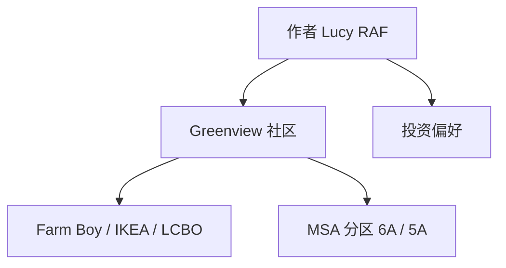

标题：  
绿地社区投资偏好分析

---

## 元信息（Metadata）

* 创建时间：2025-04-23  
* 标签（tags）：  #房地产投资 #生活便利性 #GIC选址分析 #生活设施  
* 建议文件名（filename）：greenview-community-investment.md

---

## 观点立场（Position）

作者 [[Lucy RAF]] 通过列举生活配套设施、超市、交通节点等因素，表达了对 Greenview 社区（15/25 号绿地项目）投资环境的认可，认为该区域因其生活便利性与基础设施完善而具有投资吸引力。

---

## 概念与关键词教学区

### A. 概念术语解释

- **绿地项目（Greenview）**  
  - **定义**：房地产项目名称，通常用于标识一个特定开发的住宅或商业区域。  
  - **用途**：作为购房者或投资者评估地点时的参照指标。  
  - **示例**：Greenview 15/25 号地块位于交通便利区域，周边配套齐全。  
  - **上下文背景**：本文中是作者投资关注的区域名称。  
  - **误区**：不应混淆为具体楼盘名，而是更广义的地块概念。

- **生活配套设施**  
  - **定义**：居民日常所需的超市、药房、酒类专卖、家居建材等服务设施。  
  - **用途**：评价居住区域便利性与宜居性。  
  - **示例**：Farm Boy、Loblaws、LCBO、IKEA。  
  - **上下文背景**：作者通过这些设施来说明该地区的生活便利程度。  
  - **误区**：不能仅以数量衡量质量，需结合品牌与可达性综合判断。

### B. 常见表达词/技术词

- **Farm Boy / Loblaws / LCBO / IKEA**  
  - **用法解析**：加拿大常见的食品杂货或家具品牌，代表区域生活便利度。  
  - **中英文举例**：
    - "Greenview has a nearby [[Farm Boy]], perfect for daily grocery shopping."  
    - “Greenview 社区旁边就有 [[Farm Boy]]，非常适合日常采购。”  
  - **正确语境与常见误用**：常作为地段评价中的生活便利指标，不宜误作高端商业标志。

- **MSA（Metropolitan Statistical Area）**  
  - **用法解析**：表示大都市统计区，用于评估地区的经济和人口特征。  
  - **中英文举例**：
    - "This site falls within the 6A [[MSA]] designation."  
    - “该地块位于 6A [[MSA]] 区划之内。”  
  - **正确语境与常见误用**：应基于官方定义引用，不是通俗社区划分。

---

## flowchart（mermaid）

---

## 总结（Summary）

本笔记主要整理了 [[Lucy RAF]] 对 Greenview 社区的投资分析，强调其生活设施完备、交通便利等因素对购房或投资决策的正面影响。适用于对加拿大城市房地产区域比较、选址分析感兴趣的投资者或居住者参考。

---

## 正文内容（Content）

作者：[[Lucy RAF]]

该笔记提及 Greenview® 15/25 社区的投资环境，特别强调其位于 5A 和 6A [[MSA]] 区域，周边配套包括 [[Farm Boy]]、[[Loblaws]]、[[LCBO]]、[[IKEA]] 等，展示了良好的生活便利性与成熟配套。

此外，提及的地点如 “88-100 Harbour” 等，表明作者正在对多地块或物业项目进行横向对比，从中筛选投资性价比高、交通便利、日常生活方便的区域进行关注。

---

## 思维发散区（Idea Expansion）

- 是否存在对 Greenview 区域投资风险的反方观点？例如人口密度过高或增值空间有限？  
- 可以横向延伸至其他 [[加拿大地产市场]] 分析，如北约克、万锦等地区的生活配套对比；  
- [[MSA]] 区划作为评估工具，是否也适用于其它领域，如就业分布、学校资源？  
- 可进一步构建“投资选址影响因素图谱”，串联 [[生活配套]]、[[交通节点]]、[[教育资源]]、[[安全指数]] 等概念。

---