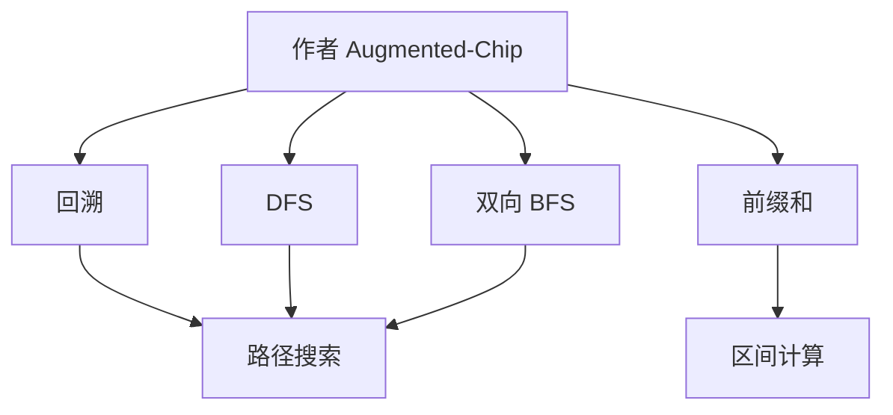

标题：  
回溯与前缀和算法技巧

---

## 元信息（Metadata）

* 创建时间：2025-04-23  
* 标签（tags）：  #算法技巧 #DFS #前缀和 #回溯 #BFS  
* 建议文件名（filename）：backtracking-prefix-sum.md

---

## 观点立场（Position）

作者强调了在复杂路径搜索问题中，结合 [[回溯]]、[[DFS]] 与 [[前缀和]] 技巧能提升效率，尤其是避免重复计算和栈溢出问题。同时指出了 [[双向 BFS]] 的实用性。

---

## 概念与关键词教学区

### A. 概念术语解释

#### [[回溯]]（Backtracking）
* **定义**：通过递归探索所有可能路径，一旦发现当前路径无效即“回退”并尝试其他选择。
* **用途**：求解排列、组合、路径搜索问题。
* **示例**：在迷宫中尝试不同路径直到找到出口。
* **上下文背景**：常用于树状问题与路径类递归求解。
* **误区**：与 DFS 不完全等价，回溯强调“撤销操作”以恢复状态。

#### [[DFS]]（Depth-First Search）
* **定义**：深度优先遍历图或树的所有节点。
* **用途**：路径搜索、连通性判断、拓扑排序等。
* **示例**：图中从起点依次探索所有可达节点。
* **上下文背景**：可用于实现回溯、子集生成等。
* **补充说明**：若递归层数过深，易导致栈溢出。

#### [[前缀和]]（Prefix Sum）
* **定义**：数组中前 i 项元素之和构成的新数组。
* **用途**：快速计算任意区间和，常用于优化时间复杂度。
* **示例**：sums[i] = arr[0] + ... + arr[i]。
* **上下文背景**：在子数组和问题中高频出现。
* **误区**：应提前初始化 prefix 数组长度为 n+1，避免越界。

#### [[双向 BFS]]（Bidirectional BFS）
* **定义**：同时从起点与终点向中间搜索，缩短搜索深度。
* **用途**：路径搜索效率优化，如求最短路径。
* **示例**：从 A 开始 BFS，同时从 B 开始逆向 BFS。
* **上下文背景**：适合起终点均已知的问题场景。
* **补充说明**：需额外存储两个方向的 visited 状态。

---

### B. 常见表达词/技术词

#### [[memoization]]
* **用法解析**：递归中用缓存避免重复子问题的求解。
* **中英文举例**：
  - 中文：我们对 DFS 的每个状态应用 [[记忆化搜索]]。
  - English: We apply memoization to each DFS state.
* **正确语境与误用**：仅适用于无副作用、可重复状态的函数；勿滥用于含全局状态场景。

---

## flowchart（mermaid）

---

## 总结（Summary）

本笔记归纳了高频算法技巧如 [[回溯]]、[[前缀和]]、[[DFS]] 与 [[双向 BFS]] 的核心概念与应用场景，并通过结构化方式提升在 Obsidian 中的知识网络可视化价值，适合算法学习者与工程实践者使用。

---

## 正文内容（Content）

作者：[[Augmented-Chip]]

* 利用 [[DFS]] 进行图遍历，结合 [[memoization]] 避免重复搜索；
* 回溯操作包含标记访问、加入路径、递归回退、撤销标记等操作；
* 提及 [[栈溢出]] 风险，可用 [[记忆化搜索]] 或改用迭代方式优化；
* 针对路径问题使用 [[前缀和]] 技巧，加快区间计算速度；
* 特别提到 [[双向 BFS]] 可显著提升从 source 到 destination 的搜索效率；
* 还涉及 [[前缀乘积]] 与 [[滑动窗口]] 等算法变种；

---

## 思维发散区（Idea Expansion）

* 可将该算法技巧套用于 [[路径规划]]、[[图神经网络]] 等高阶模型设计；
* 对于数据结构教学可构建“算法类型 vs 技术组合”网状结构；
* 可延展分析 [[动态规划]] 与 [[回溯]] 的区别与适用条件；
* 实践方向可涉及 LeetCode 高频题精讲、图可视化平台开发等。

---