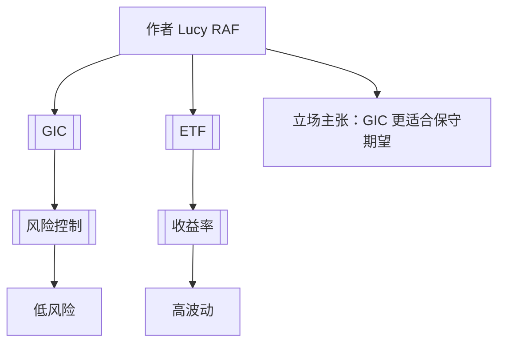

标题：  
ETF 与 GIC 比较框架解析

---

元信息（Metadata）  
* 创建时间：2025-04-23  
* 标签（tags）：  [[ETF]]  [[GIC]]  [[投资选择]]  [[收益率]]  [[风险控制]]  
* 建议文件名（filename）：etf-vs-gic-comparison.md

---

观点立场（Position）  
作者通过对比 [[GIC]] 与 [[ETF]]，探讨了两种投资工具在回报率（收益）与安全性（保障）之间的取舍问题，倾向强调 **GIC 在市场不稳定时提供更强保障能力**，而 [[ETF]] 在长期看具有更高的增长潜力。

---

概念与关键词教学区（结构型输出）

### A. 概念术语解释

#### [[GIC]]（Guaranteed Investment Certificate）  
- **定义**：一种在银行等金融机构购买的固定收益类投资产品，承诺在固定期限内返还本金和利息。  
- **用途**：用于资本保值、获取固定收益，常见于风险厌恶型投资者。  
- **示例**：一年期 GIC，年利率 4.5%。  
- **上下文背景**：文中将其与 [[ETF]] 相对比，代表低风险投资选项。  
- **误区**：很多人以为 GIC 是完全“无风险”，但若通胀超出利率，实际收益可能为负。

#### [[ETF]]（Exchange Traded Fund）  
- **定义**：一种在证券交易所交易的基金，跟踪一篮子股票、债券或其他资产。  
- **用途**：用于低成本、分散化投资，多用于长期资产配置。  
- **示例**：VOO（追踪标普500的ETF）  
- **上下文背景**：在本笔记中，ETF 代表追求长期资本增值的策略。  
- **误区**：ETF 并不等于“稳赚”，市场波动和追踪误差都可能带来损失。

---

### B. 常见表达词 / 技术词

#### [[收益率]]（Return）  
- **用法解析**：衡量投资回报的关键指标，通常以年化百分比表示。  
- **中英文举例**：  
  - “GIC 提供固定 [[收益率]]。”  
  - “The ETF offers higher expected returns.”  
- **正确语境**：用于评估不同投资工具之间的获利能力。  
- **常见误用**：将“收益”混淆为“利润总额”。

#### [[风险控制]]（Risk Management）  
- **用法解析**：指通过分散投资、对冲等手段降低损失可能性。  
- **中英文举例**：  
  - “GIC 强调 [[风险控制]] 而非收益最大化。”  
  - “Risk management is essential in volatile markets.”  
- **正确语境**：用于风险评估和资产配置分析中。  
- **常见误用**：忽略其对收益率的牺牲作用。

---

flowchart（mermaid）

---

总结（Summary）  
本笔记通过对 [[GIC]] 与 [[ETF]] 的对比，帮助理解其在不同市场条件下的适用性差异。适合用于构建个人理财策略或讲解投资入门课程，特别强调风险与收益的权衡逻辑。

---

正文内容（Content）

作者：[[Lucy RAF]]

GIC（Guaranteed Investment Certificate）是一种提供本金保障的固定收益产品，适用于希望锁定收益并避免市场波动的投资者。在文中，[[作者]] 强调 GIC 在市场不稳定时期提供的保障能力，尤其在利率上升期具有吸引力。相比之下，[[ETF]] 则具备更高的灵活性与长期增长潜力，但也伴随更大的波动与风险。作者指出，在当前经济不确定性增加的背景下，许多投资者倾向将资金转入 GIC，而非继续追逐高收益的 ETF。

从文中提到的“IRS 4 Node Uy SARS 90% I!” 和 “Dis e22” 等片段可以推测，可能讨论了投资比例配置（如 90% 配置于低风险资产）与某类系统模型或回报模拟逻辑，但原始 OCR 片段错误较多，仅可推断其意在呈现两种投资方式在组合结构中的占比差异。

---

思维发散区（Idea Expansion）

- 是否存在混合配置策略，结合 GIC 的保守性与 ETF 的成长性？
- 在不同国家（如美国 vs 加拿大）中，[[GIC]] 和 [[ETF]] 的税务待遇有何不同？
- 可否将 [[收益率]] 与 [[风险控制]] 可视化建模，用于个人财务决策辅助？
- 延伸至语言训练：如何用英语准确解释此类金融概念，用于留学或移民相关面试？  

---