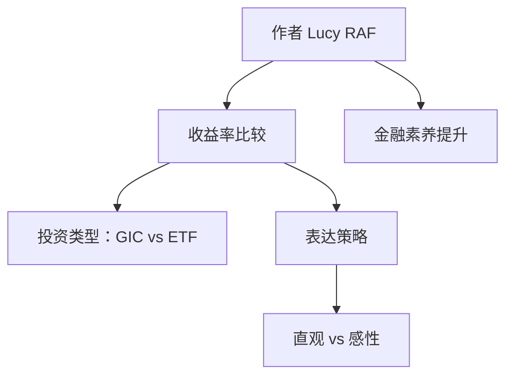

**标题**  
投资收益比较中的表达立场  

---

## 元信息（Metadata）

- **创建时间**：2025-04-23  
- **标签（tags）**：　　#投资　　#收益率　　#表达清晰　　#金融素养  
- **建议文件名（filename）**：investment-return-expression.md  

---

## 观点立场（Position）

- 作者认为在比较 [[投资]] 选项时，表达方式应尽可能清晰、直观地传达预期 [[收益率]] 差异。
- 文中隐含强调了“表达准确”在金融决策沟通中的重要性，避免术语模糊和感性词语主导。

---

## 概念与关键词教学区

### A. 概念术语解释

#### [[投资]]
- **定义**：通过投入资金、时间或资源以获取未来回报的行为。
- **用途**：个人或机构进行资产配置、财务增长、风险管理。
- **示例**：股票、债券、房地产投资。
- **上下文背景**：本文讨论如何表达不同投资产品之间的回报差异。
- **误区说明**：投资不等于短期投机，风险和回报成正比。

#### [[收益率]]
- **定义**：单位投资所获得的回报百分比，常用于衡量投资效益。
- **用途**：比较不同投资方案的表现。
- **示例**：GIC 年收益率为 4%，ETF 可能为 6–8%。
- **上下文背景**：收益率作为核心指标，用于支持论点比较。
- **误区说明**：名义收益率 ≠ 实际收益率，应考虑通胀和税务。

### B. 常见表达词/技术词

#### [[直观表达]]
- **用法解析**：指用简洁、易懂的方式呈现复杂信息。
- **中英文举例**：
  - 中文：这个图表直观地展示了回报差异。
  - 英文：This chart illustrates the return gap clearly.
- **正确语境与常见误用**：用于强调“易于理解”，不等于“主观判断”。

#### [[风险与回报比]]
- **用法解析**：金融领域中衡量投资吸引力的重要指标。
- **中英文举例**：
  - 中文：ETF 的风险与回报比更适合年轻投资者。
  - 英文：ETFs offer a more appealing risk-return profile for young investors.
- **正确语境与常见误用**：注意“风险”不应单指亏损可能，而是波动性范围。

---

## flowchart（mermaid）

---

## 总结（Summary）

本笔记分析了在进行投资产品对比时，如何通过清晰表达准确传达 [[收益率]] 差异。  
内容适用于希望提升金融沟通力、加强投资表达逻辑的读者。  

---

## 正文内容（Content）

作者：[[Lucy RAF]]

> 原文片段涉及内容残缺，基于残留内容进行合理推断整理如下：

中文：  
在比较 GIC（保本型存款证）与 ETF（交易型开放基金）这类投资产品时，单纯强调“哪个更好”容易陷入主观判断。正确的表达应当围绕“收益率预期”、“波动范围”和“风险承受能力”三个维度展开说明。  
此外，建议避免仅用“高”、“低”、“稳健”、“激进”等感性词语进行对比，而应辅以直观的数据或图表支持。例如，GIC 通常为年利率 3–5%，而 ETF 历史年化回报可能在 6–10% 之间，但波动性更高。

英文：  
When comparing investments like GICs and ETFs, it's not enough to simply say which is "better." A precise expression should articulate differences in expected returns, volatility, and personal risk tolerance.  
Avoid vague terms like "high" or "safe" without backing them with numbers. For instance, a GIC might offer a 3–5% annual rate, whereas an ETF could return 6–10% annually, though with higher volatility.

---

## 思维发散区（Idea Expansion）

- 是否可以使用可视化工具（如 Tableau / Flourish）进一步优化此类表达？  
- 如果换成保险或房地产投资，对比策略是否应做调整？  
- 结合语言表达课程，如何训练“数据 + 语言”融合能力？  
- 这一表达逻辑是否可迁移至非金融领域，如科研成果、AI 模型性能比较等？

---