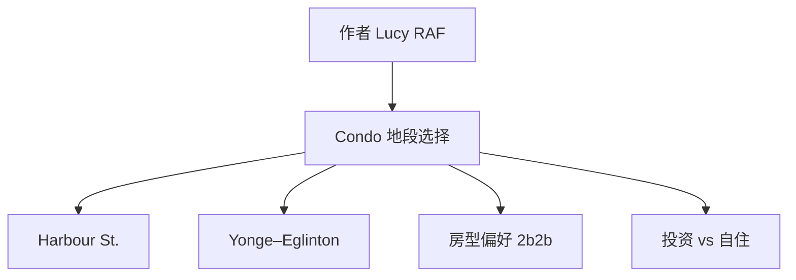

标题：  
多伦多核心地段 Condo 选择速览

---

## 元信息（Metadata）

- 创建时间：2025-04-23  
- 标签（tags）：  #房地产 #多伦多 #Condo选择 #地段分析 #投资逻辑  
- 建议文件名（filename）：toronto-condo-location-guide.md

---

## 观点立场（Position）

作者 [[Lucy RAF]] 的主要观点是：在多伦多购房时，优选地段极其关键，核心区域如 Harbour St.、Queens Quay 与 Yonge-Eglinton 区域具备更强的保值性与出租潜力。

---

## 概念与关键词教学区（Concept & Terms）

### A. 概念术语解释

#### [[Condo]]
- **定义**：即“公寓式共管住宅”，买家拥有该单元产权，但共享公共设施。
- **用途**：适合城市中心自住或投资出租。
- **示例**：88/100 Harbour St.、55 Cooper 等为典型高层 Condo 项目。
- **上下文背景**：在地价高企的多伦多，Condo 是年轻人首选。
- **误区**：易混淆与 [[Townhouse]]，后者多为独立门牌、结构更接近独立屋。

#### [[Yonge–Eglinton]]
- **定义**：多伦多市中心北部交汇地带，是办公、居住双集中区域。
- **用途**：交通便利，适合长期出租。
- **示例**：25 Holly、30 Roehampton 等高层 Condo 分布密集。
- **背景**：因 LRT 交通建设与学区配套，该区域涨幅潜力大。

#### [[核心地段]]
- **定义**：城市交通、商业、教育与生活资源高度集中的区域。
- **用途**：保障资产流动性与租售价值。
- **补充说明**：以 [[Harbourfront]] 与 Midtown 为代表，多数买家趋之若鹜。

### B. 常见表达词/技术词

#### **2b2b**
- **用法解析**：指 Two Bedroom Two Bathroom（两室两卫）的单位配置。
- **中英文举例**：
  - EN: Looking for a 2b2b unit near Queens Quay.
  - 中文：想找一套 Queens Quay 附近的 2b2b 公寓。
- **误用说明**：部分人误解为两卧一卫或带阳台，需确认楼书图纸。

#### **NETS**
- **用法解析**：疑似 NET 面积缩写（净使用面积），用于计算单位性价比。
- **英文例句**：The NETS of that 2b2b is around 750 sqft.
- **误用说明**：常被误写为 GFA（总建筑面积），两者非同一概念。

---

## flowchart（mermaid）

---

## 总结（Summary）

本笔记整理了作者 [[Lucy RAF]] 对多伦多 Condo 热门区域的偏好与推荐，主要涉及核心地段选择与房型配置考量。内容适合计划在多伦多自住或投资的购房者，亦可作为房产分析笔记使用，便于后续做决策参考与数据归档。

---

## 正文内容（Content）

作者：[[Lucy RAF]]

本笔记记录了作者对多伦多若干核心 Condo 项目的关注列表及偏好描述，部分内容为地理缩写与楼盘编号。

推荐地段如下：

- [[88/100 Harbour St.]]：临近湖滨，交通便利，视野开阔；
- [[Queens Quay]]：沿线发展成熟，生活配套齐全；
- [[138 Downes]]、[[55 Cooper]]：新开发区域，靠近 Google Smart City 区域；
- [[25 Holly]]、[[30 Roehampton]]：位于 [[Yonge–Eglinton]] 核心，教育与交通资源密集。

房型偏好方面，多次提及 [[2b2b]]（两室两卫）配置，强调适合家庭或合租市场需求。

---

## 思维发散区（Idea Expansion）

- **反方视角**：是否所有核心地段投资都值得？是否存在泡沫或供给过剩？
- **横向延展**：
  - 可结合 [[Airbnb 政策]] 变化分析出租收益；
  - 与 [[GIC]]、[[REIT]] 等其他投资方式对比；
- **纵向挖掘**：
  - 可进一步探讨不同楼盘的管理费差异、开发商信誉、社区治安等维度；
  - 与语言学习者结合，研究房产广告中常见的专业表达词；
- **可视化工具**：
  - 制作 Google Maps 可交互 Condo 分布图；
  - 利用 [[Mermaid]] 做动态筛选流程图（按预算/交通/房型）。

---